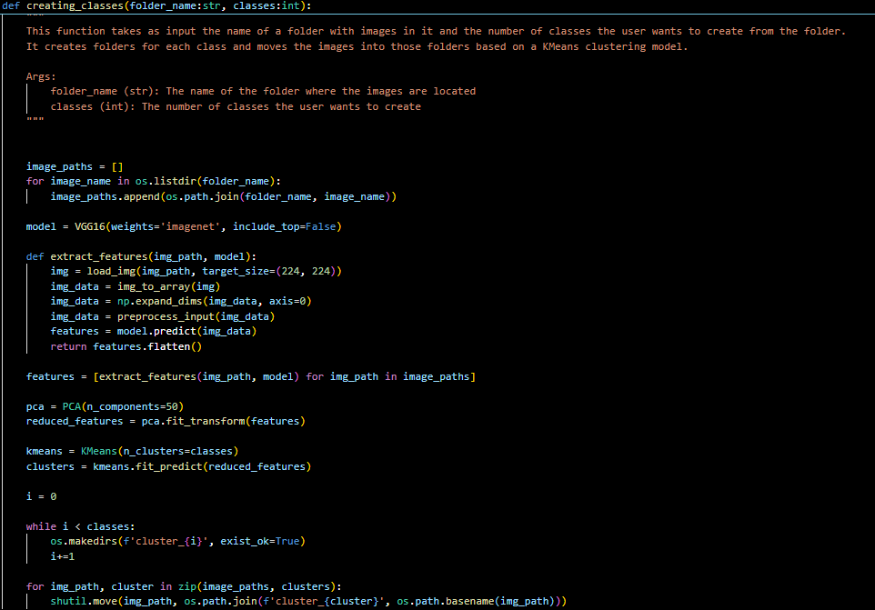

# Fingers Classification
This repo holds code for a finger classification application

# Dataset
Link to dataset - [Kaggle Fingers Dataset](https://www.kaggle.com/datasets/koryakinp/fingers)

# Unsupervised Learning
Even though the images had parts of the name to indicate which class they belong to, for example '3L' for left hands that hold up 3 fingers or '4R' for right hands that hold up 4 fingers and so on, I decided to create a function that automates the process of moving images in the right folders, since the dataset only contains one train and one test folder. There were definitely easier ways to do this, but, for the challange, I decided to use unsupervised learning for this.

Fig 1. Indicator of the class

Fig 2. Function for creating classes with unsupervised learning

The function above is split into five parts.

The first part is getting the folder paths of the images that we need to create classes for.

The second part is extracting the features of the images using the VGG16 Neural Network model.

The third part is using PCA to make the features of the images more interpretable for the KMeans algorithm.

The fourth part is applying KMeans on the extracted features.

The fith part is relocating the images based on the KMeans algorithm.